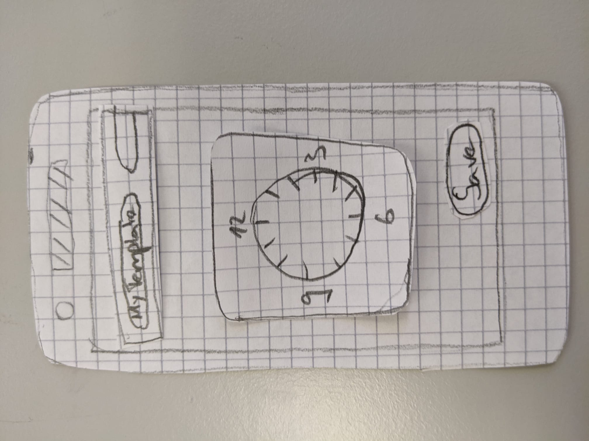
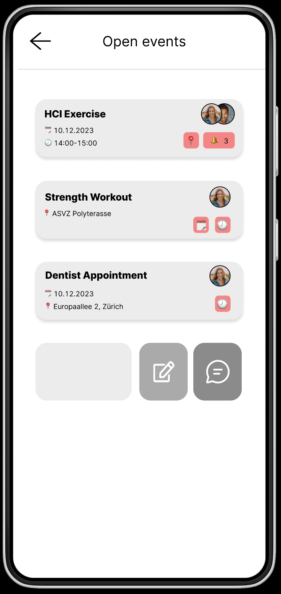

   &nbsp; &nbsp;
       

# Group Calendar, Group 12
#### Adam Dada, Rafael Fernandes, Rahul Kaundal, Livia Lehmann, Matthias Lott, Moritz Mani

## Project description

Our aim is to investigate how users can more easily interact with a (group) calendar. As multiple members of our group do not use a calendar app at all and simply rely on either their memory or scheduling alarms in the clock app, we believe that there is potential for a better solution.

If you plan a trip with friends or schedule a meeting with your co-workers, there will most certainly be an overlap of schedules. The hassle of finding a solution that works for everyone consumes a lot of time, which could be used more productively. Our aim is to create a calendar app, that not only has all the functionality of a regular agenda but allows users to create schedules collaboratively as well. Users can interact with each others calendars and thus detect conflicts early, so they can work on a solution. Additional functionalities make the planning easier and more enjoyable. We believe that a calendar is more than just a planning tool, but a personal assistant that helps you design your ideal schedule.

## Needfinding

In user-centric design, the focus lies on the user. This is why we started by interviewing 12 users (we plot some interesting information about their distribution below) in order to figure out who they are and which needs they have. We also hoped to collect some interesting tips and tricks that they use to stay organized in their everyday lives.

  

To prepare for these **interviews**, we brainstormed open-ended [questions](Deliverables/Needfinding/Questions.pdf) that are designed to let the interviewee talk. We refrained from questions that already suggested an answer to not turn the interview into an "echo chamber" and avoided asking about hypothetical scenarios. The results of the interviews can be found [here](Deliverables/Needfinding/Interviews.pdf). A short summary follows now:

<b>Interview summary</b>

Person 1:

A violinist working part-time in an orchestra and part-time independently as a teacher as well as soloist. They use a physical agenda to have an overview, know when to practise and as a look back for the past year. Additional information is stored as memos on the phone. They need a calendar that helps them not to overwork themselves. As their favourite strategy to plan group events, they have a cascading scheme, where everybody is deleting dates if they are not suitable.

Person 2:

A daycare worker that uses the google calendar app. Most information about events is stored there. They have entries for tasks as well as shopping. Further information is in a WhatsApp-chat with themselves. People that are not reliably on time are excluded from events. That is why they wish to have a way to hold people accountable. With their ADHD they need an app, that has easily understandable icons and where information can be distinguished by colour. Having personal information as private as possible is a big priority.

Person 3:

A cinematography student that uses a hybrid approach between Google Calendar and a physical agenda: All work-related events are registered in Google Calendar and leisure activities and daily notes are written down physically. They try to remember most of their events by heart without many reminders. They value the fact that Google Calendar syncs events across other work-related platforms/apps and aim to keep their app screentime low. Interestingly enough, they mentioned that it often takes them many days to agree on timing, location and other criteria when scheduling an event with friends.

Person 4:

A medicine student that only uses Google Calendar and is very adamant about the fact that they want to pool all their events, birthday reminders and study activities on the app. They want to save space by not using a physical agenda and like the recurring events plus the reminder feature on Google Calendar the most. They do not want the app to become too bloated with collaboration features to settle on things like timing & location of events. They mentioned that most criteria concerning events and activities get settled on messaging apps and only after that they register entries on Google Calendar. Also, they really like the WhatsApp polls feature which lets users collectively figure out event details on the app.

Person 5:

A computer science student that uses a calendar app on the phone, because it is portable and allows to create events and appointments on the fly. Before that, they used the Apple calendar app on the iPhone, but they didn’t like the UI. For them, the calendar should not only be a tool for planning, but it should also have an appealing look as using it becomes more engaging. The calendar app that they use at the moment is not customizable enough, as they cannot choose their own time for a reminder, hence customizability is an important aspect. If there is another person involved in the planning, coordination happens with WhatsApp if it's among friends and family and in a professional context the email service is used.

Person 6:

A recently graduated bachelor computer science student and a technology geek that previouly used a calendar app on windows but recently changed to an open source app called Etar. They are overall satisfied with their current calendar, since it has all the basic functionalities, but they are not passionate about it. They like it when the creating, editing and deleting process of an entry is fast. Functionalities such as keyboard shortcuts and drag and drop are a must have. Less crucial entries such as birthday are often forgotten, even though it has an entry and a reminder in the calendar.

Person 7:

A museum supervisor that uses a physical agenda for everything. They prefer to separate work and personal life by having two different calendars. Interacting with the agenda should be easy and fast such that using it does not become a hassle. To this end, getting an overview of upcoming meetings needs to be simple. They note down everything from appointments and meetings to personal reminders and todos.

Person 8:

A civil engineer that uses both a physical agenda and a phone app. They also prefer to have two calendars, one for work (app-based) and one for personal use (physical). Most importantly, they want the ability to schedule sensible reminders and get an overview of upcoming entries at a glance. They have a trick where they note down an appointment and the commute to/from this appointment differently.

Person 9:

An office worker that works in a team and uses Microsoft Outlook at work to communicate with said team and other office workers. They want to have a single calendar for both private and work matters, but the iPhone calendar app that they use for private matters does not synchronise with the Outlook calendar. They organise a lot of meetings and events and therefore really need an app that makes it easier to see where common free time slots are, how many and which of the invites accepted the invite and to obtain a list of other people to sort them into groups. They also often make events that are similar, but they always have to set them up individually. That is why they would welcome a feature to make custom event templates.

Person 10:

A bachelor student in computer science that used a physical agenda for a long time but lately switched to the Samsung calendar app. They want to have all their events in one calendar, but also be able to switch which sort of events are displayed. They often do group events for leisure activities, but struggle to find a time that suits everybody. That is why they want the ability to share a week or a month of one’s calendar with others, and create groups where they can see overlapping time slots. They also have recurring events that have special rules which are not accounted for in their current calendar app. This is why they advocate for custom rules (or just more options) for recurring events.

Person 11:

An older executive of a small company that has always used their agenda for planning. They developed a system that works for them. If they were to use a digital calendar it should resemble their current workflow with slight improvement. Their agenda dedicates one page to each day. They have 3 categories how they note events. Important events are on top of the page, normal events are at their designated time slot in the middle of the page while less important events or activities they want to track are at the bottom of the page. They don't need reminders but they expressed the problem that it's too tedious to copy yearly recurring events in their calendar like birthdays or holidays, which a digital calendar could fix. What we found interesting about their system is that they cross out all past events and cross down twice events that were cancelled.

Person 12:

A computer science student that currently uses google calendar to sync between their devices. It's very important for them that their calendar syncs between computer and phone. They want a weekly and daily view of their calendar and need the ability to color different kinds of events with destinct colors. They expressed a wish to just add events associated with a date and no specific time and they would want an easier interface to shift recurring events by a day to track when they need to take a certain medication. They also want to easily import their course schedules for ETH.

 

Based on the collected responses, we created an [affinity diagram](https://miro.com/app/board/uXjVNdiuBX8=/?share_link_id=207549784885) where we visualized user characteristics, their needs and their insights. 

## Ideation

We continued by looking at existing solutions, user reviews and some research papers in order to find things we might have missed during our interviews and to get a sense of what’s out there. We added these findings to our [affinity diagram](https://miro.com/app/board/uXjVNdiuBX8=/?share_link_id=207549784885).

The raw output of our **Desk Research** can be found [here](Deliverables/Desk%20Research/Desk%20Research.pdf). Some interesting findings are summarised below (categorized according to their use case):	

<b>Communication and collaboration on events/tasks:</b>

<b>TimeTree</b> is an app that aids in maintaining a shared calendar as a group. Upon adding/modifying an entry, all group members are notified so that everyone stays informed. Thanks to the built-in chat, there is no need for users to communicate using external messaging apps. Additionally, TimeTree allows having multiple separate calendars where the users can decide which of the calendars they want to see at any given moment.

  
   
  

<b>Outlook Calendar</b> is a calendar app that allows users to collectively settle and communicate in regards to meetings and events. Among other features, users can see other peoples’ timetables to spot vacant time slots for new meetings, add people to new events and inform them about shared events or related changes, and give users a daily, weekly and yearly calendar overview. According to reviews, the platform is not very customizable, however, depending on a user’s characteristics this is perceived as a negative or positive thing.

  

<b>Polling event related information:</b>

<b>Doodle</b> is an online scheduling tool that offers several different ways to set up group polls, 1:1, and booking pages that will help to quickly and efficiently set up the next meeting or event. According to user reviews, people like about Doodle that it is cross-platform compatible. Additionally, they like the ease of creating a poll and the ability to see at a glance when all participants are available.

  

<b>Categorizing/grouping events and tasks:</b>

<b>Microsoft To Do</b> is a to-do list app that is frequently used as a calendar app. The main way to structure tasks on the app is to categorize tasks into lists of different kinds (e.g. admin, study, health, etc.). Tasks can be used as any type of event and, by extension, as a calendar because of the following: One can assign a due date for tasks, set reminders and their interval, assign other users to certain tasks and add supplementary notes to tasks. Users like that by default there is a “My Day” list (displays all tasks that are due today) and a “Scheduled” list (displays all tasks that are assigned due dates).

  
  
  

<b>Trello</b> is a collaborative task tracker that can be used as a calendar: Users share a board (like a calendar) with many people who then add events as tasks. Tasks can be annotated to convey location and other details of the event, however, it is not possible to select an hour to indicate the start of an event. There are configurable reminders for events and every task has a separate chat where even images may be inserted.

  
  

<b>Finding matching event time slots:</b>

<b>Calendly</b> is a software platform that makes booking meeting slots easier. Users first set availability and then, other users can pick their time slots independently. This eliminates the constant back and forth when scheduling meetings. Calendly integrates with different calendars or payment services. In addition, it allows to automatically text reminders to invitees and set custom rules (e.g. limit number of meetings per day and how far into the future meetings can be scheduled).

  

 

As a next step, we clustered our [affinity diagram](https://miro.com/app/board/uXjVNdiuBX8=/?share_link_id=207549784885) and used it to formulate some **“How might we”** statements. Their usage was two-fold: Firstly, they acted as a summary of the Needfinding and Desk Research stages and secondly, they were the stepping stones for brainstorming ideas.

**Picture of the clustered affinity diagram:**

  

<b>How might we statements:</b>

<ol>
  <li>How might we convince people with a physical agenda to make the switch?</li>
  <li>How might we support users in keeping an overview of their entries?</li>
  <li>How might we make users enjoy interacting with the calendar?</li>
  <li>How might we help users to add entries with little effort?</li>
  <li>How might we help users to modify/delete entries with little effort?</li>
  <li>How might we aid users in reaching consensus with other people when scheduling group meetings?</li>
  <li>How might we assist users to customize the calendar to their liking?</li>
  <li>How might we decrease the chance of forgetting about/being late to an entry?</li>
</ol>

 

Based on our “How might we” statements, we brainstormed solution approaches that try to satisfy user needs. The focus was on generating as many ideas as possible while disregarding feasibility for now. We used a slightly modified version of Approach B (as explained in the exercise session): In a first step, each member of the group brainstormed individually and explained the idea in detail in our [brainstorming document](Deliverables/Brainstorm/Brainstorming.pdf). Additionally, to keep an overview, they added a post-it on our new brainstorming miro board. Afterwards, we came together to discuss our ideas and tried to come up with new ones by combining or extending existing ones. Finally, we clustered our ideas in another [affinity diagram](https://miro.com/app/board/uXjVNdBhuco=/?share_link_id=547932901104).

**Picture of the clustered brainstorming ideas:**

  

## Low-fidelity Prototype

Next up, we started prototyping. We thought about scenarios in which our app might be used and created storyboards, short image strips that show how a user might interact with the app. To make the interaction more tangible, we also created a paper prototype to better flesh out the flow.

### Idea A - Basic Usage

Our first interaction focused on a user entering an appointment into the calendar. Even though this is not a group interaction, users expressed that they want an app that also supports entries not related to group activities. Additionally, we believe that many design considerations for entering "solo-entries" also translate to group entries.
In the storyboard, a user is able to streamline the creation of an entry by selecting a template that not only **autofills some information** (the name of the entry) but also **adds additional information**, like the location of the appointment.

  

We also created a paper prototype to get a better feel how adding an entry might work. In these [slides](Deliverables/LowFiPrototyping/IdeaA/Paper/Prototype.pdf) you will find an example walkthrough with the prototype, some highlights below:

  
  
  

### Idea B - Polling

Our second interaction investigated the collaboration between users planning an event that is suitable for all participants. The core mechanic we explored was **polling functionality**.
Our fictitious person faces the problem of planning a trip with their friends, but they don't know when their friends are available. To overcome this challenge, they use **polling functionality**, where they select free time slots and then add people to vote for a time slot. After that, they can see the result and choose a definitive time slot.

  

We made a paper prototype to demonstrate a basic way how to schedule a group event in the app. We made it modular so we could hopefully reuse it later. This short video shows the interaction on a phone:

  

We also created an additional storyboard for a business setting (compare this to the other storyboard that depicts planning a trip among friends):

  

### Idea C - Get Lucky

Our third interaction focused on making the calendar app more engaging to use and collaborative across a user group. In the storyboard, a user who feels like organising a group event with their group of friends can simply create a **“get-lucky”** event (inspired by Google's "I'm Feeling Lucky" feature) and add all relevant friends. The app then takes the preferences, locations and timetables of all participating users into consideration and proposes an interesting activity. All users get notified once the chosen event is registered and, after the event has taken place, participants are asked to give feedback in order to improve the “get-lucky” feature.

  

    
## Mid-fidelity Prototype

Moving from the low-fidelity to the mid-fidelity prototypes was a challenge. When creating the low-fi prototypes, we made the mistake of not discarding enough ideas, so we ended up with 3 ideas (how might a single user use the app, how might a group of users use the app, and a very specific feature). All three of these ideas could potentially end up in the final prototype. However, the scope of this would be too big and wouldn’t leave us any room for deciding which mid-fi prototype we wanted to expand to our high-fidelity prototype.
After discussing these issues with our TA, they recommended us to expand our first idea into a proper group setting - after all, our task was to create a group calendar - and turn each of our paper prototypes into a mid-fi prototype, making sure that there was as little overlap as possible between the ideas (we achieved this by splitting our team into two and pursuing the ideas completely separately). This would enable us to make a decision between the two mid-fi prototypes at the relevant stage.

### Prototype A - Templates

To retrofit our prototype into the group setting, we decided to let users create an entry without specifying a date or time. This enables them to decide later, based on the availability of the other participants. Conversation among participants would be enabled by a chat feature, inspired by all the people that regularly use messenger apps to find suitable time slots.

We focused the design of our prototype in hopes of getting answers to the following questions:
1. Do the users like the ability to create their own templates to speed up the event creation process or is it too much of a hassle?
(Note: This is probably a question that should have already been asked while looking at the low-fi prototype, but we didn’t have a feedback round for that iteration.)
2. How is the general flow of adding an entry? Is it quick enough so that using it doesn’t feel like a hassle? How can its usability be improved further?
3. Do the users like the flexibility of not having to specify all details of an entry immediately and coming back to completing the entry later on?
4. Do users value the possibility of chatting with other participants in order to come to a conclusion about event details?
5. Do the users like the various overviews they can see? Is there something that is not optimal or missing?
(Clarification: We want to get feedback on the **information** that is displayed, not the final look of the overview which will definitely change.)

While designing the prototype, we struggled quite a bit with the complexity. We realised that Figma has the option to save some state (but only in the premium version), however, in the end we decided against it as it was not necessary in order to convey the idea of the overall flow. As a result, some components, especially the date and time picker may feel a bit unrefined and will most likely have a slightly different interaction.

Our prototype can be found [here](Deliverables/MidFiPrototyping/IdeaA/Prototype.pdf) as a pdf, but we heavily encourage you to [play with it yourself](https://www.figma.com/proto/WW8ersVm8axOB4AnjbA2pJ/Template-Prototype?type=design&node-id=1-2&t=lFF2tnybt1LyxojK-0&scaling=scale-down&page-id=0%3A1&starting-point-node-id=1%3A2). A short video and a few images follow:

  
  
  
  
  

### Prototype B - Polling

The second prototype was based on the polling low-fi prototype, so there was little change in features unlike in prototype A. Again, using Figma to achieve what we had in mind proved to be quite challenging due to so many features being behind a pay-wall. 

The focus of the design revolved around the polling functionality. We hoped to answer these questions:
1. How do users like planning a group event within the app?
2. Does everything behave the way users expect it to - if not, how could this be fixed?
3. Do users miss a critical feature when they try to plan an event?
4. Do users have an easy time navigating the app? Is the structure intuitive and clear?

In the following gallery, the first two videos show a **user creating a group event** and a **user selecting their availability**. The center picture shows a home screen with access to functionality, such as Invites, Friends and Chats. The remaining two images highlight how **participants are added** and what they see when **entering their availability**.

  
  
  
  
  

A pdf of the prototype can be found [here](Deliverables/MidFiPrototyping/IdeaB/Prototype.pdf). Again, we highly recommend you to [play with the prototype yourself](https://www.figma.com/proto/VuoPxSZHwxReBMSU15ny8l/rfernandes's-team-library?type=design&node-id=2437-5767&t=JDZMBO75Zy36QOxl-0&scaling=scale-down&page-id=2437%3A4503&starting-point-node-id=2437%3A5767&show-proto-sidebar=1) in order to properly experience the interactivity.

### Evaluation
Next up, we held an informal **evaluation** session with other groups (and our TA) to decide which prototype to move forward with and to get additional input on how to proceed. Three of us went to different groups as testers, Rahul went to group 11, Oliver to group 17 and Moritz to group 19. The other three acted as presenters. We came up with the following [protocol](Deliverables/MidFiPrototyping/Evaluation/Protocol.pdf) where we essentially just asked the questions that drove the development of our mid-fi prototypes. The raw output of our evaluations can be found [here](Deliverables/MidFiPrototyping/Evaluation/RawNotes.pdf). A summary of the feedback we received can be found below:

<b>Summary of Feedback:</b>

Because prototype A focused heavily on the features we wanted to get the users’ opinion on, there were many suggestions for specific functionalities that weren't implemented in the mid-fi prototype, but are vital for the finished app. Examples of such core functionalities are a screen where friends can be added, the ability to accept/decline invites and the possibility to add events not only through the floating action button in the bottom right corner, but also by selecting a day in the regular calendar overview.  
Many responses to specific questions were mixed. For example some people liked the various overviews and could imagine using them all, while others felt overwhelmed by the many views. We made a similar observation with the chat feature that was appreciated by some people (finally, there is no need to create new WhatsApp channels for each event anymore), but others were put off that there is yet another chat they need to keep track of.  
Thankfully, there were some points everyone agreed on. Even though not all testers immediately recognised that they could simply omit information when creating an entry, they all mentioned that they like the functionality of open events and the flexibility in planning that it brings. Also, the template functionality was very popular and people agreed that using it will very likely decrease event creation time.

Prototype B on the other hand took a wider approach (it contained a friend list and prototype overview) which is why the visuals were a bit less refined. This led to a broader range of features, but also more critique on the visual appearance, even though we were only analyzing a mid-fi prototype. Thankfully, we still managed to get some valuable feedback regarding the features. 
We received mixed reactions on the intuitiveness of the application. One suggestion was that same-themed buttons should be grouped on the screen, e.g. all social components should be placed near each other. Similarly for the ones concerning calendar functionality. 
Like prototype A, prototype B also received feedback about calendar functionality that was left out on purpose. 
Testers found the combination of polling and time calculation faster and easier. In general, the approach on simplifying group event planning was appreciated, but concerns came up in regards to the app-specific use case of calculating events for everyone in a group. A functional planning system requires all participants to have the same app.

In conclusion, the feedback we received wasn’t all that different. In both prototypes, people appreciated the speed-up in event creation, but they weren’t happy that we didn’t implement a complete app yet. Overall however, people preferr prototype A, especially because of the idea of open events which seems to be novel, whereas prototype B has certain similarities to doodle. It seemed that prototype A has a bigger impact on the usual flow of users. That’s why we decided to iterate on prototype A. 

## High-fidelity Prototype

Based on this feedback, we decided to further refine prototype A. There were two other aspects that also influenced our decision. Firstly, prototype A explored new functionality that isn’t prevalent in current calendar apps, while prototype B “reinvented” a polling feature which many apps support. Secondly, prototype B’s functionality is something that could be embedded in basically any calendar - including our final high-fi prototype. Thus, it would make sense to combine the two ideas later on, if time permits it.

We envisioned the following functionality to be present for demonstrating the idea as a whole:
 - Template creation and management where a user can create new templates and modify/remove existing ones.
 - Creating events, both starting from a template and from scratch. Things that should definitely be supported are specifying name, date, time, duration, location, color, notes.
 - Calendar views, such that a user can view the events they just created (monthly, weekly, daily, chronological and events that do not yet have a specified date (open events)).

For the A/B test we wanted to include these features:
 - **Variant A**: A grid based layout with large buttons similarly as depicted in our mid-fi prototype to select templates.
 - **Variant B**: The layout is based on a vertical list of templates instead of the grid view of variant A.

As a framework, we settled on [React Native](https://reactnative.dev/) because many group members were already familiar with it and we hoped that it would give us better structured source code than plain HTML/JS/CSS.

Before actually embarking on the implementation of the high-fidelity prototype in React Native, we decided to design an approximate blueprint of all required screens in Figma. Our thoughts behind that decision were that if we had the approximate design already available, it would, firstly, make the app design more homogeneous and secondly, simplify the distribution of the programming tasks among group members since everyone could take the design on Figma as a reference.

  
  
  
  
  

The complete design blueprint of the high-fidelity prototype can be found [here](https://www.figma.com/file/xeqNvp6t64G5uaHQiatbMn/Hi-fi-Design-Templates?type=design&node-id=0-1&mode=design&t=m4jNeyxm3rmdOhA4-0).

With the design blueprint in place, we set out to implement it. In general, we split the tasks into two separate buckets: a small backend and the frontend. The backend should take care of handling the preloaded data as well as any new data that is added by users of the app, and provide helper functions to the frontend. The frontend itself makes use of the backend to display all necessary data and establish the predetermined user interaction flows. 

We implemented all the functionality that we mentioned a few paragraphs above and made sure to stick to the approximate design that was created in Figma as best as possible. In the end, we altered some design considerations due to specific constraints that arose during the implementation process. Below you can see some highlights of our React Native calendar app:

  
  
  
  

  
  
  
  
  

  
  
  
  
  

We encourage you to play with our app and experience it yourselves. In order to do that, please follow the instructions for running the prototype [here](code/README.md).

## User study

In order to conduct a **user study**, we first needed to plan it. We decided to investigate how the layout of our template selection screen influences the user. Even though we didn’t get explicit feedback on the selection screen during our informal evaluation, we imagined that as the amount of templates of a user grew, the layout of the template selection screen would play an ever increasing role in their ability to efficiently use it (we assume that this particular feedback didn’t arise during the mid-fi prototype evaluation because we hard-coded 6 templates and didn’t support scrolling). Furthermore, getting this right would have a huge benefit because this screen not only comes up when modifying templates but every time the user creates an event.

We imagined displaying the events in a grid view for variant A. The grid view provides a higher information density and allows to select a template more efficiently (less scrolling required), what we already had in our mid-fi prototype. As variant B, we decided on a vertical list. This puts a focus on making the different templates more easily digestible by displaying less items at a time on the screen.
It was not clear a priori which variant would lead to a faster process. Variant A’s compact design might have a bigger impact on the time it takes to select a template than variant B’s simplified display.

As we were mainly interested in user speed and mental load, we came up with the following null hypotheses, we hoped to get interesting results for at least three of them:

1. There will be no effect of changing the grid view to a list view on the time a user needs to select a template (actual speed).
2. There will be no effect of changing the grid view to a list view on the time a user thinks they need to select a template (perceived speed).
3. There will be no effect of changing the grid view to a list view on mental load.
4. There will be no effect of changing the grid view to a list view on users selecting the wrong template (user errors).
5. There will be no effect of changing the grid view to a list view on the usability of the selection screen.

In order to find out whether the null hypothesis could be rejected or not, we needed to collect data. This was split into the following 4 groups:
1. **Participant data:** We collected basic demographic data and the user’s current familiarity with digital calendars:
   - Age (as a number)
   - Gender (male/female/other)
   - Technical affinity (on a scale from 1 to 10)
   - Familiarity with calendar apps (never/rarely/often/daily)
2. **Subjective ratings:** We prepared a questionnaire containing:
   - Some questions from the [NASA questionnaire](https://en.wikipedia.org/wiki/NASA-TLX) to find the mental load (this would allow us to answer hypothesis 3)
   - Some questions from the [SUS questionnaire](https://www.researchgate.net/publication/228593520_SUS_A_quick_and_dirty_usability_scale) to gauge the usability of the design (hypothesis 5)
   - Some additional questions that ask the user about their perceived speed (hypothesis 2)
3. **Performance data:** We measured the following information (the first three would hopefully allow us answer hypothesis 1, while the last one would answer hypothesis 4). We planned to collect the first 3 types inside the app while taking notes on the last point by hand:
   - Time spent on the template selection screen.
   - How much the user scrolled on the template selection screen.
   - Amount of times the user selected a wrong template. Repetitions also count as errors. If a user misclicked twice in a row, it would be counted as two mistakes.
4. **Qualitative feedback:** We wanted to ask the users for any feedback that they might have (let the user talk). If we noticed something special during the test, we’d bring it up here and ask them to clarify.

Lastly, we thought about the task we wanted the users to perform: To lower the variance of our measurement we hoped to let the user interact three times with the template interaction screen. The three templates were chosen to be at different places on the screen:
1. Modify the “Lunch with Friends” template by setting its color to green.
2. Plan a cinema night using the template “Cinema Night” next Wednesday at 19:00 lasting 2 hours.
3. Plan a trip to the zoo using the template “Zoo” next Saturday.

We wrote up a preliminary study protocol which can be found [here](Deliverables/Study/Preliminary_Protocol.pdf).

In a feedback session we were given the following ideas to improve our study:
 - Maybe remove the hypothesis about mental load. The variants might not have a huge impact on this metric and the user doesn't like filling out so many questions.
 - Think about making the task harder (e.g. not specify the exact template the user needs to click on but features of the template or shuffle the templates randomly every time a user visits the template selection screen). 

### Pilot Study

Next, we conducted a pilot study where we interviewed three people, 2 of them were members of our group, the third person was from outside of the HCI circle. We highlight some of the observations we made during the pilot study and their changes to the study design:
 - In the pilot phase, we already tested the random shuffling that was suggested by our TA. This seemed to be enough to increase the difficulty of the task, as some errors were made during the test.
 - The study was taking way too long, even the people from our group needed more than 30 minutes to complete it. We corrected this by removing a subtask.
 - The NASA questionnaire was not appropriate. The participants felt especially perplexed when reading the question "How physically demanding was the task?" and the questionnaire was indeed quite long already, leading to fatigue of the testers. Thus, we removed it which also lowers the completion time of the study.
 - We still weren't quite sure what to expect of the final results. Because we wanted to keep our options open (and hypothesis 3 can't be answered anymore without the NASA questionnaire), we changed it to "There will be no effect of changing the grid view to a list view on the amount that the user has to scroll.".

Here is our final [study protocol](Deliverables/Study/Study_Protocol.pdf) and our [task sheet](Deliverables/Study/Task_Sheet.pdf).

### Data Analysis
Running the actual study went well, we managed to stay within the time limit and the participants seemed quite content with the shorter questionnaire. However, even though we thought the task would be difficult enough, only one person made a mistake. In the end we decided to exclude hypothesis 4 and focus on actual speed, perceived speed, scroll amount and usability which is a nice mix of subjective ratings (perceived speed & usability) and performance data (actual speed & scroll amount).

- Actual Speed: Users do not take less time selecting templates in variant A than in variant B ($p = 0.194$).
- Perceived Speed: Users do not think they need less time selecting templates in variant A than in variant B ($p = 0.089$).
- Scroll Amount: Users do not scroll less when selecting templates in variant A than in variant B ($p = 0.388$).
- Usability: Users do not find the usability of the template system in variant A higher than the one of variant B ($p = 0.174$).

However, looking at the averages of the four variables, variant A performed better than variant B. Users were faster, thought they were faster, scrolled less and ranked it slightly more usable. We touch upon this in more detail in the [study report](Deliverables/Study/Study_Report.pdf).